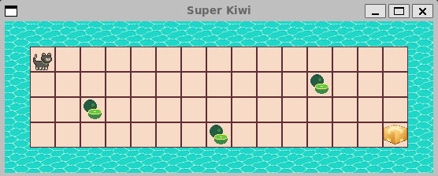
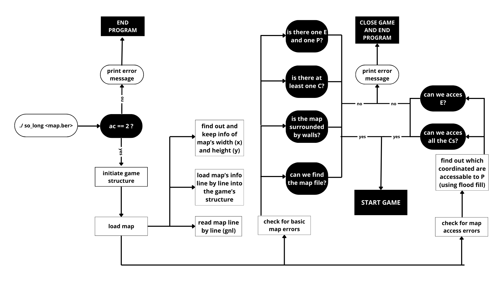
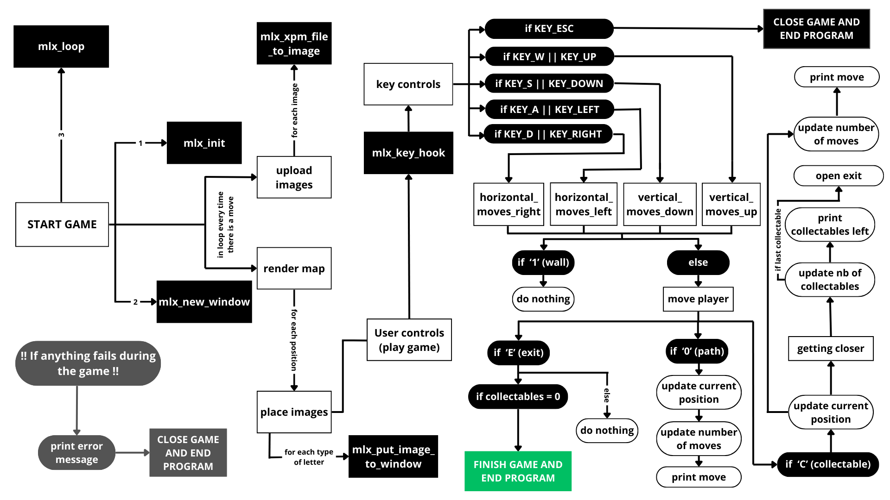
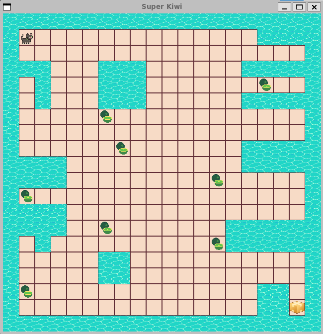

# SO_LONG: Super Kiwi

    

## 1. About the project
This project aims to create a basic 2D game using the mlx library, where a character must collect all the collectables in the game and exit throught the exit point. 

## 2. Game Rules
- The game must follow a set of rules.
- If any of these rules don't comply, a a custom error message must be displayed in the terminal.
- When the game finishes, a custom message must be displayed in the terminal.
- The number of moves must be displayed in the terminal.
- The makefile must create the executable so_long, which will receive a map as the only argument. This map must be a .ber filetype. When the

### Map rules:
1. The map should be comprised of 1s (wall), 0s (free path), a P (player), an E (exit) and Cs (Collectables). 
2. There must be 1 player (P) - no more, no less.
3. There must be 1 exit (E) - no more, no less.
4. There must be at least 1 collectable (C).
5. The map must be rectangular shaped.
6. The map must be closed, surrounded by walls
7. The collectables and the exit must be accessible to the player.

The goal is for the player to collect all the collectables on the map before going to the exit point.

## 5. About the code

### PART 1 - Parsing
1. Checking if there is a map.
2. Reading and loading the map.
3. Checking for basic map errors.
4. Checking for access errors.

     

## PART 2 - The game
1. Starting the game.
2. Playing the game.
3. Closing the game.

    

## 4. About Super Kiwi
Super Kiwi is a jolly nice cat thal loves to eat kiwis and playing in cardboard boxes. He must collect all the kiwis in the game before getting to the open box!

### To test invalid maps:
1. Download the zipped folder;
2. Run <make> to compile;
3. Run <./so_long maps/invadid/map[...].ber> (run with any of the invalid map options.
   
### To play:
1. Download the zipped folder;
2. Run <make> to compile;
3. Run <./so_long maps/valid/map1_valid_big.ber> OR <./so_long maps/valid_map2_valid_small.ber>

    

